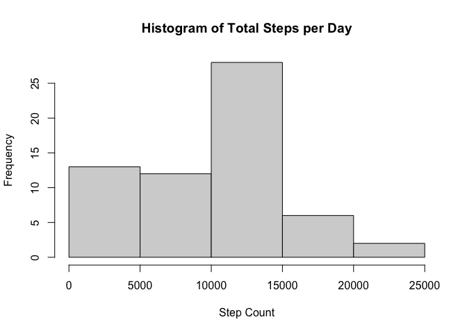
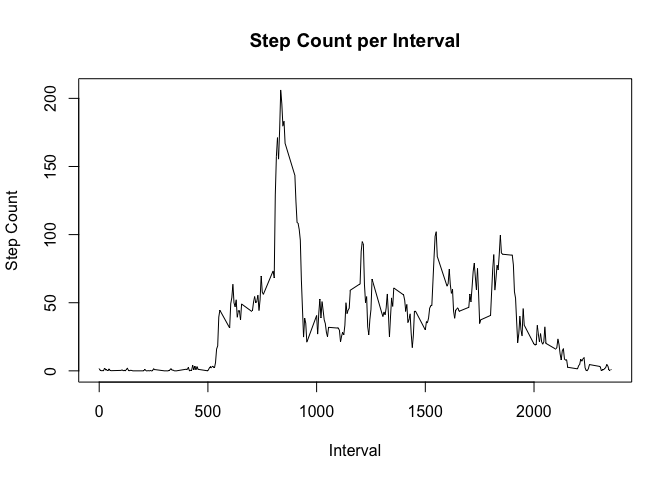
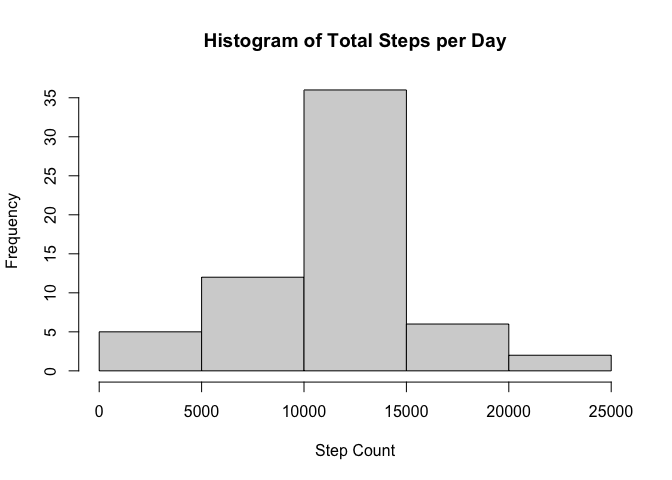
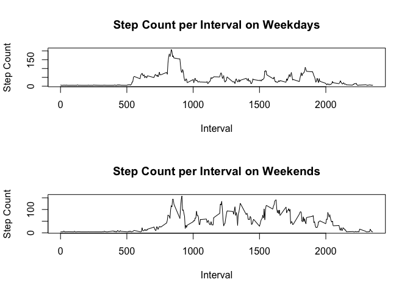

## Loading and preprocessing the data
Here we will process the data. 

```r
download.file("https://d396qusza40orc.cloudfront.net/repdata%2Fdata%2Factivity.zip", "activity.zip", "curl")
unzip("activity.zip") 
activity <- read.csv("activity.csv")
activity$interval <- as.numeric(activity$interval)
activity$steps <- as.numeric(activity$steps)
activity$date<-as.Date(activity$date)
```

## What is mean total number of steps taken per day?
Here is a histogram of the total number of steps taken per day

```r
require(dplyr)   
```

```
## Loading required package: dplyr
```

```
## 
## Attaching package: 'dplyr'
```

```
## The following objects are masked from 'package:stats':
## 
##     filter, lag
```

```
## The following objects are masked from 'package:base':
## 
##     intersect, setdiff, setequal, union
```

```r
sum_steps <- aggregate(activity$steps, by = list(activity$date), FUN = sum, na.rm = TRUE)
hist(sum_steps$x, main = "Histogram of Total Steps per Day", xlab = "Step Count")
```

<!-- -->
Here is the mean number of steps taken per day.

```r
mean(sum_steps$x)
```

```
## [1] 9354.23
```
Here is the median number of steps taken per day.

```r
median(sum_steps$x)
```

```
## [1] 10395
```

## What is the average daily activity pattern?
Here is a line plot of the average number of steps taken in each time interval, averaged across the days. 

```r
interval_steps <- aggregate(activity$steps, by = list(activity$interval), FUN = mean, na.rm = TRUE)
plot(interval_steps$Group.1, interval_steps$x, type = "l", xlab = "Interval", ylab = "Step Count", main = "Step Count per Interval")
```

<!-- -->
This is the starting time of the 5 minute time interval that has the most steps on average every day. 

```r
interval_steps[interval_steps$x == max(interval_steps$x),]$Group.1
```

```
## [1] 835
```

## Imputing missing values
Here is the number of missing rows in the dataset

```r
sum(is.na(activity))
```

```
## [1] 2304
```
Next we will fill in the missing values by replacing it with average value number of steps taken total, regardless of time interval.

```r
activity2 <- activity
avg <- mean(activity2$steps, na.rm = TRUE)
activity2[is.na(activity2$steps),]$steps <- avg
```
Here is a histogram of the total number of steps taken per day with the missing values filled in.

```r
require(dplyr)   
sum_steps2 <- aggregate(activity2$steps, by = list(activity2$date), FUN = sum, na.rm = TRUE)
hist(sum_steps2$x, main = "Histogram of Total Steps per Day", xlab = "Step Count")
```

<!-- -->
Finally, here are the means and medians with the missing values replaced. The mean and mean are both larger.

```r
mean(sum_steps2$x)
```

```
## [1] 10766.19
```

```r
median(sum_steps2$x)
```

```
## [1] 10766.19
```

## Are there differences in activity patterns between weekdays and weekends?
Here is a graph of the differences in step count between weekends and weekdays for each interval, averaged by dates.

```r
activity3 <- activity2
activity3$date <- weekdays(activity3$date)
weekday <- subset(activity3, date %in% c("Monday", "Tuesday", "Wednesday", "Thursday", "Friday"))
weekend <- subset(activity3, date %in% c("Saturday", "Sunday"))
weekday_steps <- aggregate(weekday$steps, by = list(weekday$interval), FUN = mean, na.rm = TRUE)
weekend_steps <- aggregate(weekend$steps, by = list(weekend$interval), FUN = mean, na.rm = TRUE)
par(mfrow=c(2,1))
plot(weekday_steps$Group.1, weekday_steps$x, type = "l", xlab = "Interval", ylab = "Step Count", main = "Step Count per Interval on Weekdays")
plot(weekend_steps$Group.1, weekend_steps$x, type = "l", xlab = "Interval", ylab = "Step Count", main = "Step Count per Interval on Weekends")
```

<!-- -->
